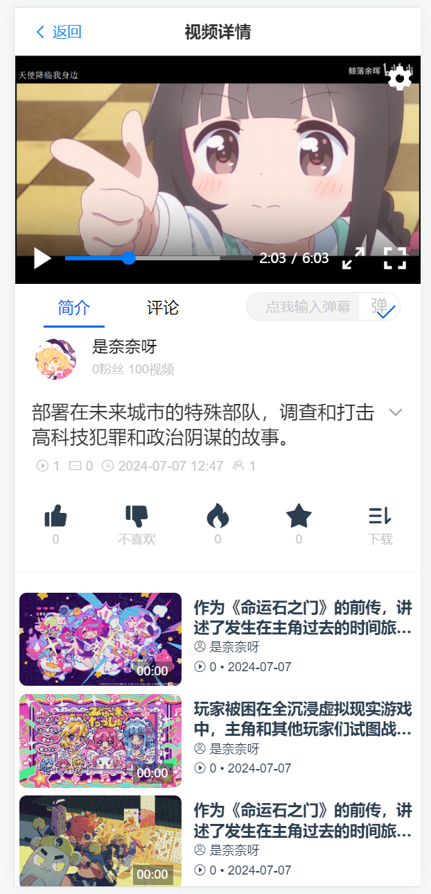
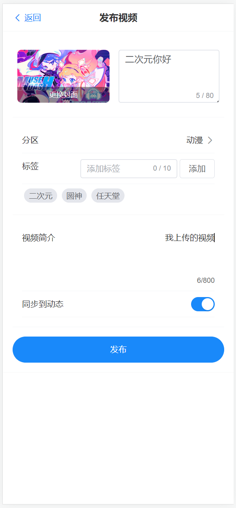
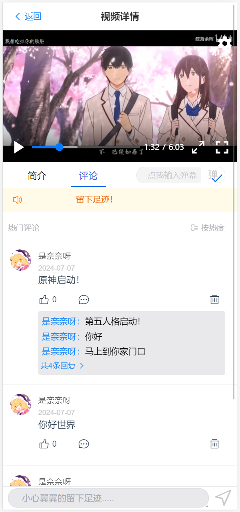
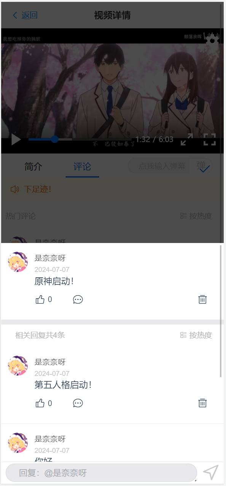
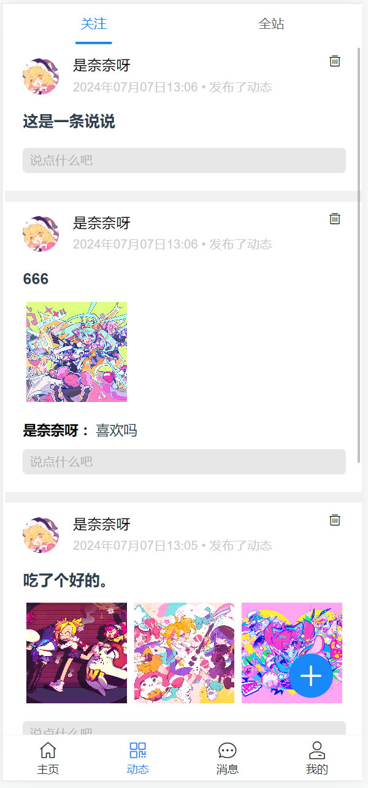
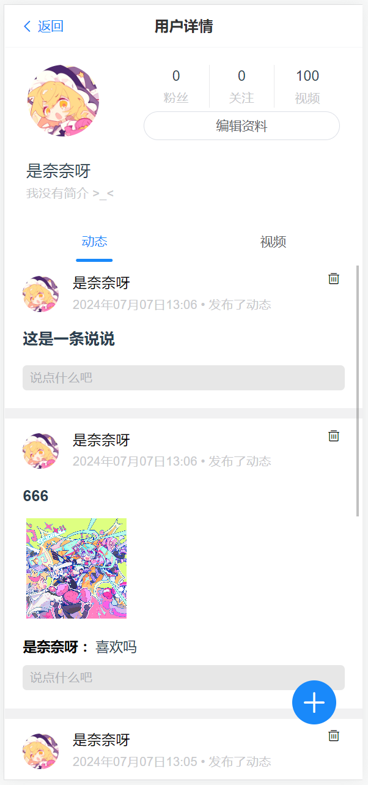
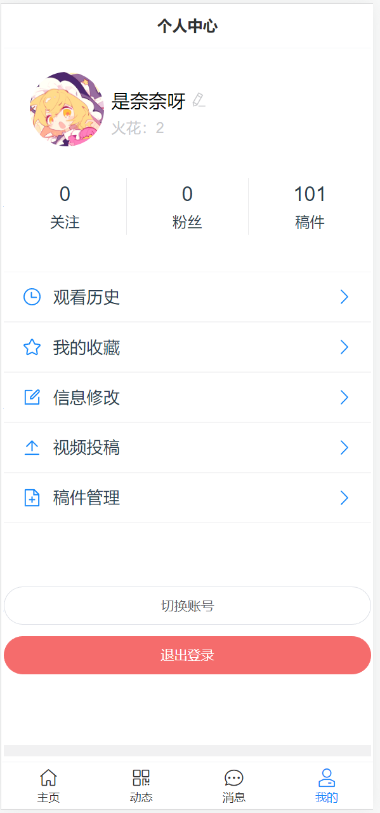

## 一、开始

### 相关地址链接
```sh
    后端地址：https://gitee.com/wls_javawyxawd/sp-servser
    管理端地址：
    爬虫服务地址：
```

### 前端项目初始化

```sh
npm install
```

### 运行

```sh
npm run dev
```

### 打包

```sh
npm run build
```

### 功能介绍
```sh
    登录注册、自动登录
    视频投稿、视频播放（同时在观看人数）、视频评论收藏点赞、弹幕发送
    动态发布、动态评论
    用户信息修改（头像上传裁剪，昵称等）、用户关注
    消息通知（动态评论信息、视频点赞收藏评论）
```

## 二、效果预览

### 主页面


### 播放页面

### 视频上传

### 一级评论区

### 二级评论区


### 动态页


### 角色页面




等等等等

## 三、目录结构
```
src
│   App.vue
│   main.js
│   
├───api
│       http.ts
│       WebSocket.ts
│
├───assets
│       base.css
│       logo.svg
│       main.css
│
├───components
│   │   test.html
│   │
│   ├───comment    视频评论
│   │       comment-section-card.vue    视频评论卡片
│   │       comment-section-reply.vue    二级评论区页面
│   │       comment-section.vue            视频评论页面
│   │       input-comment.vue            评论输入框
│   │
│   ├───home  主页面  
│   │   │   home.vue
│   │   │
│   │   ├───main 主页面--推荐
│   │   │       home-main-home-dm.vue  tap分级--"动漫栏目"
│   │   │       home-main-home-qt.vue  tap分级--"其他栏目"
│   │   │       home-main-home-sh.vue  tap分级--"生活栏目"
│   │   │       home-main-home-ys.vue  tap分级--"影视栏目"
│   │   │       home-main-home.vue     tap分级页
│   │   │
│   │   ├───msg  主页面--消息
│   │   │       home-msg-chat.vue
│   │   │       home-msg-comment-like.vue        消息卡片--评论点赞
│   │   │       home-msg-comment-reply.vue       消息卡片--评论回复
│   │   │       home-msg-head-car.vue        
│   │   │       home-msg-head.vue                消息界面
│   │   │       home-msg-space-comment.vue       消息卡片--动态评论
│   │   │       home-msg-video-collection.vue    消息卡片--视频收藏
│   │   │       home-msg-video-comment.vue       消息卡片--视频评论
│   │   │       home-msg-video-like.vue          消息卡片--视频点赞
│   │   │       home-msg.vue
│   │   │
│   │   ├───search
│   │   │       search-result.vue                搜索结果页面
│   │   │       search-view.vue
│   │   │
│   │   ├───space  主页面--动态
│   │   │       home-space-add.vue             动态发布页          
│   │   │       home-space-select.vue          动态tap页
│   │   │       home-space-shuo-card.vue       动态卡片--说说
│   │   │       home-space-video-card.vue      动态卡片--视频
│   │   │       home-space.vue                 关注角色的动态页
│   │   │       home-space2.vue                社区动态页
│   │   │       home-space3.vue                用户详情动态页
│   │   │
│   │   └───user  主页面--用户页
│   │       │   home-main-manager-user.vue        个人中心页--点击头像
│   │       │   user-concern-card.vue             关注列表卡片
│   │       │   user-concern.vue                  关注列表
│   │       │   user-dynamic.vue                  个人动态页
│   │       │   user-setting-video-card.vue       稿件修改--卡片
│   │       │   user-setting-video-setting.vue    稿件修改
│   │       │   user-setting-video.vue            稿件修改--列表
│   │       │   user-setting.vue                  用户信息修改页面
│   │       │   user-someone.vue                  粉丝列表
│   │       │   user-video-uploder.vue            稿件上传页面
│   │       │
│   │       └───time 观看历史
│   │               time-card.vue    历史记录卡片
│   │               time-view.vue    观看历史页
│   │
│   ├───login 登录相关
│   │       login-change.vue    修改密码
│   │       login-enroll.vue    注册
│   │       login-yazm.vue      验证码组件
│   │       login.vue           登录页面
│   │
│   └───view
│           router.vue            空页面--中继路由
│           tes2.html
│           test.html
│           test.vue
│           ttt.html
│           view-comments.vue     tap分级--评论区
│           view-user.vue         tap分级--用户页面
│           view.vue              视频详情页面
│
├───css
│   ├───mobile
│   │       comment-section-card.css
│   │       comment-section-reply.css
│   │       comment-section.css
│   │       home-main-home.css
│   │       home-main-manager-user.css
│   │       home-msg-chat.css
│   │       home-msg.css
│   │       home.css
│   │       input-comment.css
│   │       search.css
│   │       time-card.css
│   │       time-view.css
│   │       user-video-uploder.css
│   │       view-user.css
│   │       view.css
│   │
│   └───pc
│           home.css
│           view-user.css
│           view.css
│
├───public
│       interlude_Miku_in_Museland_3.png
│ 
├───router 路由
│       router.js
│
├───store 全局变量
│       DataStore.ts  全局变量
│       RouterStore.ts
│       test.js
│       UserSrore.ts  用户信息
│
└───util
        type.ts  类型
        util.ts

```

## 四、后续展望
```sh
    安卓原生重构项目
    实现私信功能（聊天室）
```

